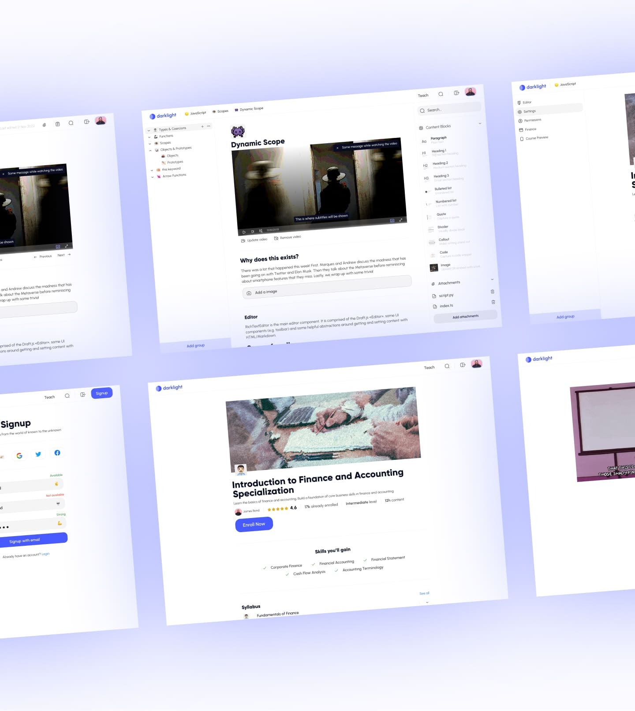

# darklight-backend

DarkLight is a web application where you can enroll in courses and learn from them. If you are aspired to be a teacher, you can create your own courses and teach them to the world.

This is the web backend for DarkLight. It is built using ExpressJS, MongoDB, Stripe, & Jest.



## Installation

First, clone the repository and install the dependencies.

```bash
git clone https://github.com/AkashSDas/camps-for-champs-backend.git
cd camps-for-champs-backend
npm install
```

Then polulate the .env file with the following variables. You can find the example of the .env file in the .env.example file.

## Environment Variables

A sample .env file is provided in the repository. You can use it as a reference to create your own .env file.

- Setup basic authentication
- Setup OAuth ([Google](https://console.cloud.google.com/welcome), [Twitter](https://developer.twitter.com/en/portal/dashboard), [Facebook](https://developers.facebook.com/apps/))
- Setup [Stripe](https://stripe.com/docs/development#api-keys) for payments
- [Cloudinary](https://cloudinary.com/) for image uploads
- [Mailtrap](https://mailtrap.io) for sending emails
- [MongoDB](https://www.mongodb.com/) for database
- There are some basic env like frontend url & so

## Tech Stack

- ExpressJS, Zod
- MongoDB, Mongoose, Typegoose
- Cloudinary & Express File Upload
- JWT, Cookie Parser
- CORS
- PassportJS (Google, Twitter, Facebook)
- Swagger
- Jest, MongoDB Memory Server, Supertest

## TODO

- [ ] Add more tests and fix existing tests
- [ ] Refactor code, responses
- [ ] Add Postman collection

## LICENSE

[MIT](./LICENSE)
